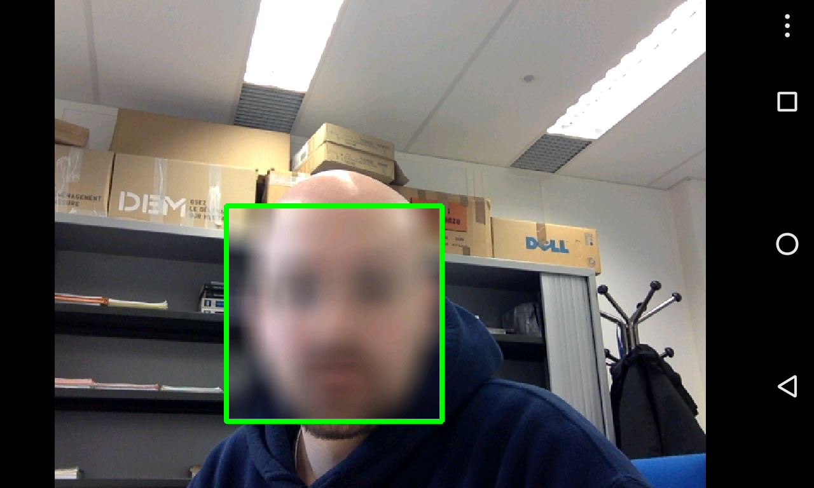

# Android Defacer - The ultimate privacy protector

The application run with `OpenCV` camera, it detects and tracks the faces on the video stream and pixelize the faces.

## OpenCV
The opencv manager and the OCV library must be installed on the device. If the Google 
Play app is available it can be done just installing them from Google App. Just search 
for Opencv Manager and the proper version of the library.

Otherwise if the device has no Google Play, it has to be installed manually (for the TP the libraries are already installed at `[OCVsdk]=/mnt/n7fs/ens/tp_gasparini/OpenCV-3.4.0-android-sdk`, so you can skip to step 3):

1. download the latest version of Opencv4Android binaries
[http://opencv.org/downloads.html](http://opencv.org/downloads.html)

2. unzip it (say `[OCVsdk]` is where you unzip it)

3. start Android Studio and launch the device emulator

4. install the manager for the architecture of the device (eg. for a x86 emulator)
    
    `adb install [OCVsdk]/apk/OpenCV_3.4.0_Manager_3.40_x86.apk`

5. check on the device, there should be an application called OpenCV Manager, 
open it and check that the library are correctly installed

Note: You might have to use the absolute path to get the `adb` command on the lab machines, ie:
```
/mnt/n7fs/android-test/platform-tools/adb install [OCVsdk]/apk/OpenCV_3.4.0_Manager_3.40_x86.apk`
```


## Setting up in Android Studio

In order to build the application you need the NDK (Native Development Kit) installed (see [Android NDK](http://developer.android.com/tools/sdk/ndk/index.html)). 

Once you have installed it, you need to configure the project by telling Android Studio the path to the NDK. According to the version of Android Studio you are using you can do it in one of these two ways:

* `File > Project Structure...` and under `SDK Location` give the path to the NDK in the related field;

* or manually editing the `local.properties` file in the root of this project by adding a line `ndk.dir=path/to/android/ndk` at the end (eg. for the lab machines it is `/mnt/n7fs/android/android-ndk-r10d/`).

The sources contain the whole OpenCV library (sic...) for what concerns the Java interface. Since this project is also using OpenCV in the JNI part, we need to be able, at compilation time, to find the C/C++ headers of OpenCV. For that, as before, there is a line in `app/src/main/jni/Android.mk` that includes the OpenCV `.mk` for that. For now the path is hard coded (for the lab machines it should be `/mnt/n7fs/ens/tp_gasparini/OpenCV-2.4.10-android-sdk/sdk/native/jni/OpenCV.mk`), if you are running the project on your own machine you have to change it to the path where you unzipped the OpenCV archive. 

### x86 Emulator rocks!

Using an x86 emulator with the optimization plugin the performance are pretty awesome.

## Screenshots

